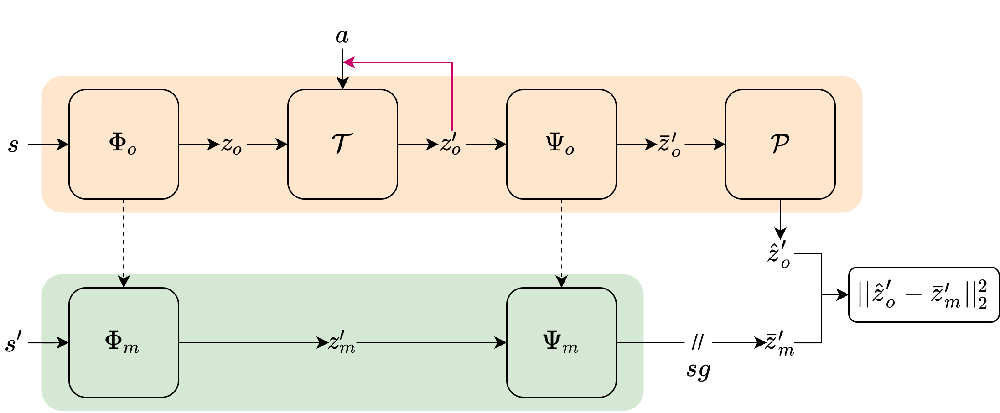

  

# Representation Learning for Data-Efficient Reinforcement Learning

    
    

### Abstract
Deep reinforcement learning (RL) agents that exist in high-dimensional state spaces, such as those composed of images, have two learning burdens: (a) they must learn an action-selection policy that completes their given task and (b) they must learn to discern between useful and useless information in the state space. The reward function is the only supervised feedback that RL agents receive, which causes a representation learning bottleneck on (b) that ultimately manifests in poor sample efficiency. In this thesis, we explore representation learning methods for RL in the context of the popular PlaNet benchmark suite, a set of six continuous control tasks with image-based states. We introduce k-Step Latent (KSL), a new representation learning method that provides state-of-the-art (SotA) results in this suite. KSL accomplishes these results by exploiting the environment's underlying Markov decision process via a learned recurrent environment transition model in the latent space. Finally, we spend time analyzing the representations that are learned by KSL and other previous SotA methods. Through this analysis, we uncover a set of desirable characteristics of latent representations as they relate to the RL goal. Using these characteristics, it may be possible to design new representation learning methods in the future that open the door for feasible real-world RL applications. 

### KSL

  

To read more about KSL, its performance, and the analysis of its latent projections, please see [my website](https://trevormcinroe.github.io/thesis/).